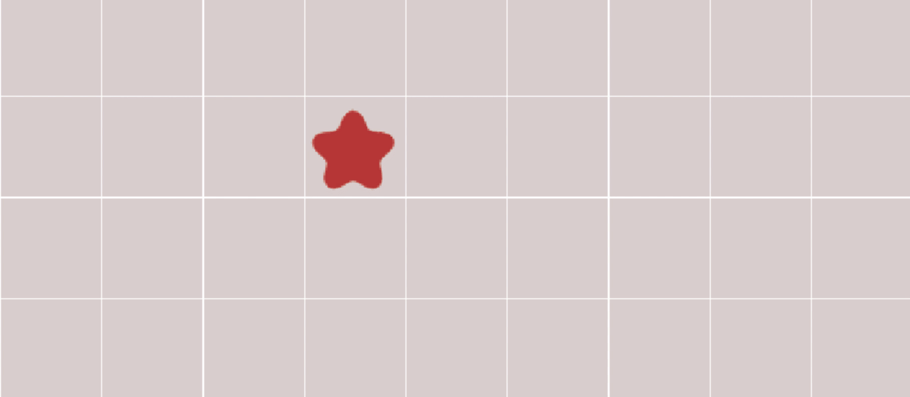
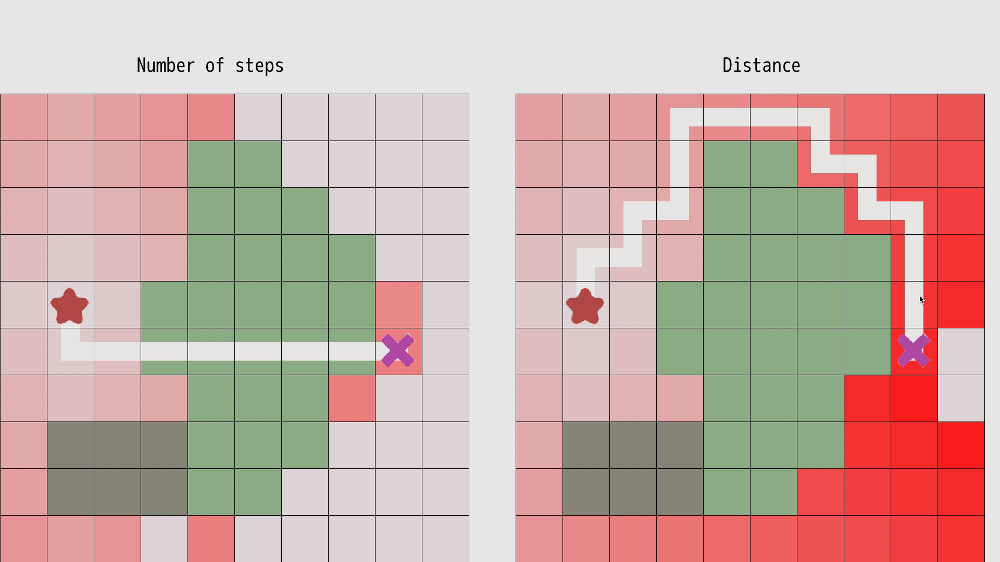
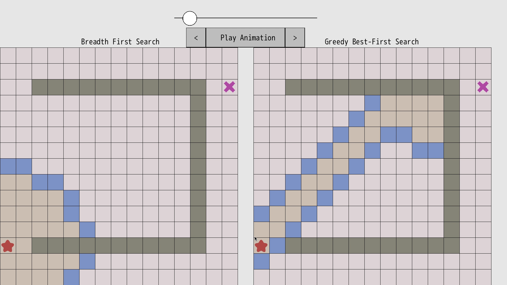
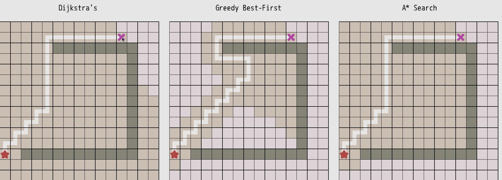

# Info

A series of algorithms that demonstrate the purpose of the A* algorithm
Based off of https://www.redblobgames.com/pathfinding/a-star/introduction.html

# How to Run

1. You need a license to [DragonRuby Game Toolkit](http://dragonruby.org) (**income assistance is provided to those who can't afford to pay**).
2. Download the code here and put all the files under the `mygame` directory located in the Game Toolkit environment.
3. Run `./dragonruby` to launch the game.
4. Change code to see the updates reflected live.

# Breadth First Search

# Detailed Breadth First Search

# Early Exit Breadth First Search

# Movement Costs 

# Heuristic

# Heuristic With Walls

# A*

